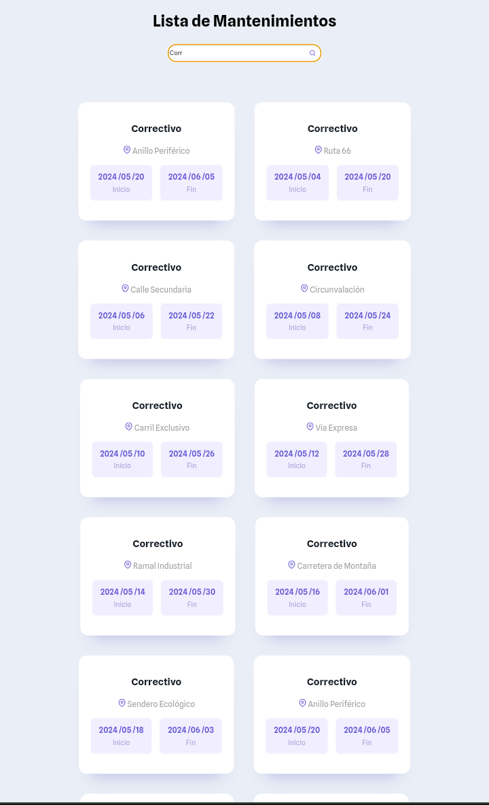

### Mantenimiento de Vías - Lista de Mantenimientos

¡Bienvenido a la lista de mantenimientos de vías! Este proyecto consume una API que proporciona información sobre diferentes tipos de mantenimiento en vías públicas y ofrece un panel de búsqueda para facilitar la exploración de los datos.

#### Descripción del Proyecto

Este proyecto está diseñado para brindar a los usuarios una visión clara y organizada de los diferentes tipos de mantenimiento de vías que se llevan a cabo en una determinada área. Utilizando datos proporcionados por una API externa, el proyecto muestra detalles importantes como el tipo de mantenimiento, ubicación, fecha de inicio y fecha de finalización.

#### Funcionalidades Principales

- **Interfaz de Usuario Intuitiva:** La interfaz de usuario ha sido diseñada de manera intuitiva para facilitar la navegación y comprensión de la información sobre los mantenimientos de vías.

- **Panel de Búsqueda Dinámica:** Se incluye un panel de búsqueda que permite a los usuarios buscar tipos específicos de mantenimiento de vías. La búsqueda es dinámica y los resultados se actualizan en tiempo real a medida que se ingresan los criterios de búsqueda.

- **Visualización Clara de Datos:** Cada mantenimiento de vías se presenta de forma clara y organizada, mostrando detalles importantes como la ubicación y las fechas de inicio y finalización en un formato legible y fácil de entender.

#### Contribuciones y Desarrollo Futuro

Este proyecto está abierto a contribuciones de la comunidad. Si tienes ideas para mejorar la experiencia del usuario, agregar nuevas funcionalidades o corregir errores, ¡no dudes en enviar tus contribuciones a través de solicitudes de extracción!

#### Agradecimientos Especiales

Queremos agradecer a la comunidad de desarrolladores y a los [creadores](https://github.com/Anyel-ec) de la API utilizada en este proyecto por su continuo trabajo y dedicación para hacer que los datos sobre mantenimiento de vías estén disponibles y accesibles para todos.
Agradecemos también a la [página](https://feathericons.com/?query=Fin) de dónde se extrajo los siguientes svg:
- 
- 

El diseño de este proyecto fue gracias a los códigos css disponibles en linea de forma gratuita de la siguiente [página](https://codepen.io/havardob/pen/PoJapGX).
El diseño extraido fue adaptado a las necesidades del proyecto dejando solo lo fundamental.

¡Esperamos que disfrutes explorando la lista de mantenimientos de vías y que esta herramienta sea útil en tu día a día!
